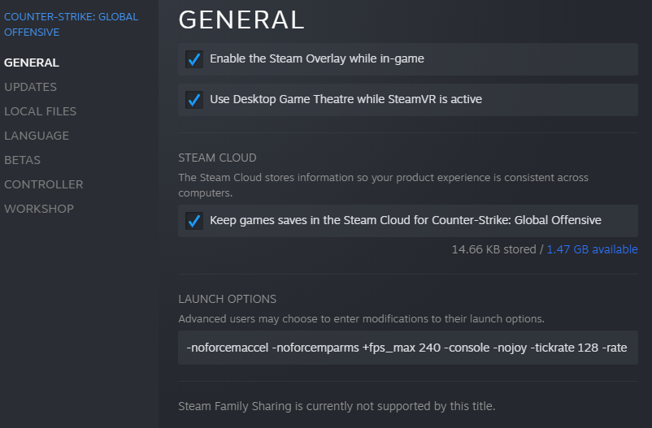

# IN-GAME CONFIGURATION

### **LAUNCH OPTIONS**
```-noforcemaccel -noforcemparms +fps_max 240 -console -novid -tickrate 128 -rate 786432 +cl_interp_ratio 1```



### **GAME & VIDEO SETTINGS**
You can copy video settings by replacing files [Playing](https://github.com/JustMangoT/JustMangoT/tree/main/Game%20Settings/CSGO/Config%20for%20Playing) or [Movie Making](https://github.com/JustMangoT/JustMangoT/tree/main/Game%20Settings/CSGO/Config%20for%20Movie%20Making)

### **CUSTOM BINDS**
Jumpthrow:

``alias "+jumpthrow" "+jump;-attack"; alias "-jumpthrow" "-jump"; bind alt "+jumpthrow"``

# AMD CONFIGURATION


<p>&nbsp;</p>


